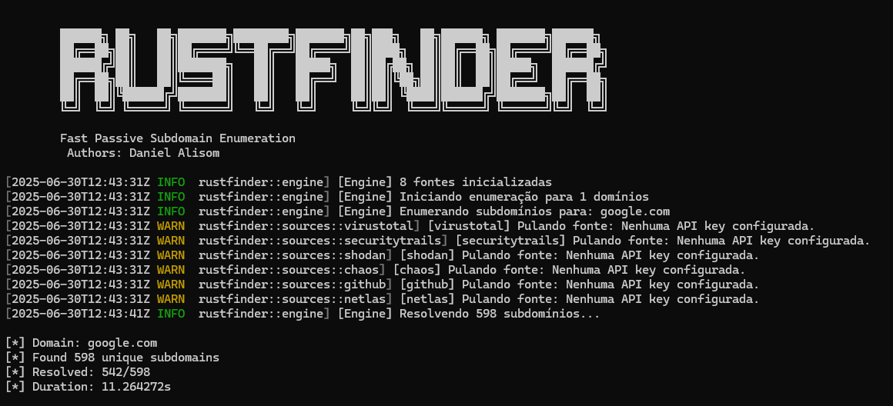

# RustFinder 🦀

**Ferramenta rápida de enumeração passiva de subdomínios escrita em Rust**

[](https://www.rust-lang.org/)
[](https://opensource.org/licenses/MIT)
[](https://github.com/rustfinder/rustfinder)

<!-- Espaço reservado para a captura de tela -->

<!-- Fim do espaço reservado para a captura de tela -->

RustFinder é uma ferramenta de enumeração de subdomínios passiva de alto desempenho projetada para descobrir subdomínios usando várias fontes online sem interagir diretamente com a infraestrutura do alvo. Construído com Rust para máximo desempenho, segurança e concorrência.

**Autores:** Daniel Alisom

## ✨ Funcionalidades

- 🚀 **Alto Desempenho**: Async/await com Tokio para enumeração concorrente
- 🔒 **Segurança de Memória**: Construído com as garantias de segurança do Rust
- 🌐 **Mais de 40 Fontes**: Suporta as principais fontes como CRT.sh, VirusTotal, SecurityTrails, etc.
- 🔑 **Suporte a API**: Chaves de API configuráveis para limites de taxa aprimorados
- 🎯 **Verificação Ativa**: Resolução de DNS opcional para verificar subdomínios
- 🦆 **Detecção de Curinga**: Detecção e filtragem inteligente de DNS curinga
- 📊 **Múltiplos Formatos de Saída**: Saída em texto, JSON e diretório organizado
- ⚡ **Limitação de Taxa**: Limites de taxa configuráveis por fonte
- 🔍 **Correspondência de Padrões**: Filtragem e correspondência baseadas em regex
- 📈 **Estatísticas**: Estatísticas detalhadas de enumeração
- 🔄 **Atualizações Automáticas**: Mecanismo de atualização integrado

## 📦 Instalação

### Método 1: Binários Pré-compilados (Recomendado)

Baixe a versão mais recente para sua plataforma:

**Linux/macOS (linha única):**
```bash
curl -fsSL https://raw.githubusercontent.com/rustfinder/rustfinder/main/install.sh | bash
```

**Windows (PowerShell):**
```powershell
# Baixar a versão mais recente
Invoke-WebRequest -Uri "https://github.com/rustfinder/rustfinder/releases/latest/download/rustfinder-windows.exe" -OutFile "rustfinder.exe"

# Mover para o PATH (opcional)
Move-Item rustfinder.exe $env:USERPROFILE\bin\rustfinder.exe
```

### Método 2: A Partir do Código-Fonte

**Pré-requisitos:**
- Rust 1.70+ (instale em [rustup.rs](https://rustup.rs/))
- Git

```bash
# Clonar o repositório
git clone https://github.com/rustfinder/rustfinder.git
cd rustfinder

# Construir em modo de lançamento
cargo build --release

# Instalar globalmente
cargo install --path .

# Ou copiar o binário manualmente
sudo cp target/release/rustfinder /usr/local/bin/
```

### Método 3: Usando o Cargo

```bash
# Instalar do crates.io
cargo install rustfinder

# Instalar a versão mais recente do git
cargo install --git https://github.com/rustfinder/rustfinder.git
```

### Método 4: Docker

```bash
# Construir a imagem Docker
docker build -t rustfinder .

# Executar com o Docker
docker run --rm -it rustfinder -d example.com

# Executar com o volume de configuração
docker run --rm -it -v ~/.config/rustfinder:/root/.config/rustfinder rustfinder -d example.com
```

## 🚀 Início Rápido

### Testar o RustFinder (Não são necessárias chaves de API)

```bash
# Testar com fontes gratuitas
rustfinder -d example.com -s crtsh,hackertarget

# Verificar quais fontes estão disponíveis
rustfinder --list-sources

# Ver a ajuda
rustfinder --help
```

### Adicionar Suas Chaves de API para Potência Total

1. **Criar o diretório de configuração:**
```bash
mkdir -p ~/.config/rustfinder
```

2. **Baixar a configuração de exemplo:**
```bash
curl -L "https://raw.githubusercontent.com/rustfinder/rustfinder/main/config-daniel-example.yaml" -o ~/.config/rustfinder/config.yaml
```

3. **Editar com suas chaves de API:**
```bash
nano ~/.config/rustfinder/config.yaml
```

4. **Testar com suas APIs:**
```bash
# Usar suas APIs do SecurityTrails + Shodan + Chaos
rustfinder -d example.com -s securitytrails,shodan,chaos --stats

# Enumeração completa com todas as suas APIs
rustfinder -d example.com --all --active --json -o results.json
```

## ⚙️ Configuração

### Configurando Chaves de API

O RustFinder funciona muito bem sem chaves de API usando fontes gratuitas, mas as chaves de API desbloqueiam fontes adicionais e limites de taxa mais altos.

**Criar o diretório de configuração:**
```bash
# Linux/macOS
mkdir -p ~/.config/rustfinder

# Windows
mkdir %APPDATA%\rustfinder
```

**Copiar a configuração de exemplo:**
```bash
# Baixar a configuração de exemplo
curl -L "https://raw.githubusercontent.com/rustfinder/rustfinder/main/config.yaml.example" -o ~/.config/rustfinder/config.yaml

# Editar com suas chaves de API
nano ~/.config/rustfinder/config.yaml
```

**Exemplo de configuração:**
```yaml
# Chaves de API essenciais para melhores resultados
virustotal:
  - "sua_chave_de_api_do_virustotal"
securitytrails:
  - "sua_chave_de_api_do_securitytrails"
chaos:
  - "sua_chave_de_api_do_chaos"
shodan:
  - "sua_chave_de_api_do_shodan"
github:
  - "ghp_seu_token_do_github"

# Dica pro: Múltiplas chaves permitem balanceamento de carga
censys:
  - "chave1:segredo1"
  - "chave2:segredo2"
```

## Usage

### Opções Básicas

```bash
# Especificação do alvo
rustfinder -d example.com              # Domínio único
rustfinder -d example.com,test.com     # Múltiplos domínios
rustfinder -l domains.txt              # Domínios de um arquivo
echo "example.com" | rustfinder        # Da entrada padrão

# Opções de saída
rustfinder -d example.com -o results.txt          # Saída de texto
rustfinder -d example.com --json -o results.json  # Saída JSON
rustfinder -d example.com -oD ./results           # Saída em diretório
rustfinder -d example.com --silent                # Modo silencioso
```

### Opções Avançadas

```bash
# Seleção de fontes
rustfinder -d example.com --all                   # Usar todas as fontes
rustfinder -d example.com -s crtsh,virustotal     # Fontes específicas
rustfinder -d example.com --exclude-sources shodan # Excluir fontes
rustfinder -d example.com --recursive             # Apenas fontes recursivas

# Resolução de DNS
rustfinder -d example.com --active                # Verificar com DNS
rustfinder -d example.com --active --ip           # Incluir endereços IP
rustfinder -d example.com --remove-wildcards      # Filtrar curingas

# Ajuste de desempenho
rustfinder -d example.com -t 20                   # 20 threads
rustfinder -d example.com --rate-limit 50         # 50 req/seg
rustfinder -d example.com --timeout 60            # Timeout de 60 seg
rustfinder -d example.com --max-time 15           # Enumeração máxima de 15 min

# Filtragem
rustfinder -d example.com -m ".*\\.prod\\..*"     # Padrão de correspondência
rustfinder -d example.com -f ".*\\.test\\..*"     # Padrão de filtro

# Opções de rede
rustfinder -d example.com --proxy http://proxy:8080
rustfinder -d example.com --resolvers 8.8.8.8,1.1.1.1
```

## Fontes

O RustFinder atualmente suporta 8 fontes para enumeração de subdomínios:

### Fontes Gratuitas (Não é necessária chave de API)
- **crtsh** - Certificate Transparency
- **hackertarget** - HackerTarget

### Fontes de API (Requerem Chaves de API)
- **chaos** - Chaos Dataset
- **github** - GitHub Code Search
- **netlas** - Netlas.io
- **securitytrails** - SecurityTrails
- **shodan** - Shodan
- **virustotal** - VirusTotal

## Contribuição

Contribuições são bem-vindas! Sinta-se à vontade para enviar um Pull Request.

## Licença

O RustFinder está licenciado sob a Licença MIT.

## Agradecimentos

- Inspirado no [Subfinder do ProjectDiscovery](https://github.com/projectdiscovery/subfinder)
- Construído com [Tokio](https://tokio.rs/) para tempo de execução assíncrono
- Usa [Reqwest](https://github.com/seanmonstar/reqwest) para cliente HTTP
- CLI desenvolvido com [Clap](https://github.com/clap-rs/clap)

## Aviso Legal

O RustFinder destina-se a pesquisas de segurança e caça a bugs. Os usuários são responsáveis por garantir que têm permissão para testar em seus alvos. Os autores não se responsabilizam por qualquer uso indevido desta ferramenta.

---

**Feito com carinho por Daniel Alisom e 🦀 pela equipe RustFinder**
